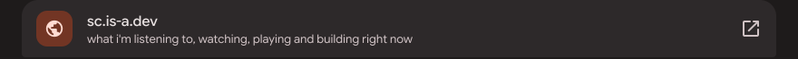
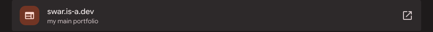
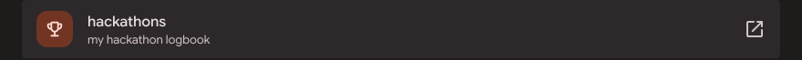
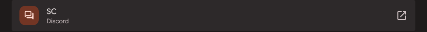
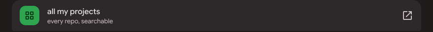
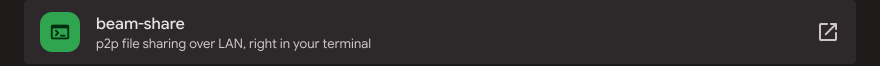
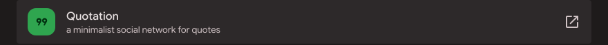
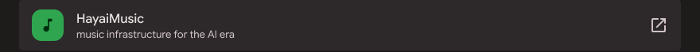

<!-- Styled after sc.is-a.dev (Material 3 Expressive, "default" palette). Every image here lives in assets/m3. -->

<a href="https://sc.is-a.dev"><picture><source media="(prefers-color-scheme: dark)" srcset="assets/m3/hero-dark.svg"><source media="(prefers-color-scheme: light)" srcset="assets/m3/hero-light.svg"></picture></a>

<picture><source media="(prefers-color-scheme: dark)" srcset="assets/m3/find-top-dark.svg"><source media="(prefers-color-scheme: light)" srcset="assets/m3/find-top-light.svg"></picture> 
<a href="https://sc.is-a.dev"><picture><source media="(prefers-color-scheme: dark)" srcset="assets/m3/find-1-dark.svg"><source media="(prefers-color-scheme: light)" srcset="assets/m3/find-1-light.svg"></picture></a> 
<a href="https://swar.is-a.dev"><picture><source media="(prefers-color-scheme: dark)" srcset="assets/m3/find-2-dark.svg"><source media="(prefers-color-scheme: light)" srcset="assets/m3/find-2-light.svg"></picture></a> 
<a href="https://sc.is-a.dev/hackathons/"><picture><source media="(prefers-color-scheme: dark)" srcset="assets/m3/find-3-dark.svg"><source media="(prefers-color-scheme: light)" srcset="assets/m3/find-3-light.svg"></picture></a> 
<a href="https://discord.com/users/594504468931018752"><picture><source media="(prefers-color-scheme: dark)" srcset="assets/m3/find-4-dark.svg"><source media="(prefers-color-scheme: light)" srcset="assets/m3/find-4-light.svg"></picture></a> 
<a href="https://discord.gg/UVWjuAh"><picture><source media="(prefers-color-scheme: dark)" srcset="assets/m3/find-5-dark.svg"><source media="(prefers-color-scheme: light)" srcset="assets/m3/find-5-light.svg"></picture></a>

<picture><source media="(prefers-color-scheme: dark)" srcset="assets/m3/made-top-dark.svg"><source media="(prefers-color-scheme: light)" srcset="assets/m3/made-top-light.svg"></picture> 
<a href="https://swar.is-a.dev/projects.html"><picture><source media="(prefers-color-scheme: dark)" srcset="assets/m3/made-1-dark.svg"><source media="(prefers-color-scheme: light)" srcset="assets/m3/made-1-light.svg"></picture></a> 
<a href="https://github.com/SC136/beam-share"><picture><source media="(prefers-color-scheme: dark)" srcset="assets/m3/made-2-dark.svg"><source media="(prefers-color-scheme: light)" srcset="assets/m3/made-2-light.svg"></picture></a> 
<a href="https://www.quotation.social"><picture><source media="(prefers-color-scheme: dark)" srcset="assets/m3/made-3-dark.svg"><source media="(prefers-color-scheme: light)" srcset="assets/m3/made-3-light.svg"></picture></a> 
<a href="https://music.hayai.tech"><picture><source media="(prefers-color-scheme: dark)" srcset="assets/m3/made-4-dark.svg"><source media="(prefers-color-scheme: light)" srcset="assets/m3/made-4-light.svg"></picture></a> 
<a href="https://github.com/SC136/Simple-Music-Bot"><picture><source media="(prefers-color-scheme: dark)" srcset="assets/m3/made-5-dark.svg"><source media="(prefers-color-scheme: light)" srcset="assets/m3/made-5-light.svg"></picture></a>

<picture><source media="(prefers-color-scheme: dark)" srcset="assets/m3/code-dark.svg"><source media="(prefers-color-scheme: light)" srcset="assets/m3/code-light.svg"></picture>

