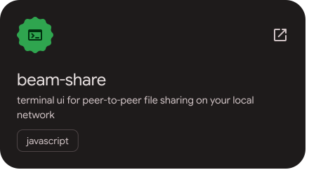
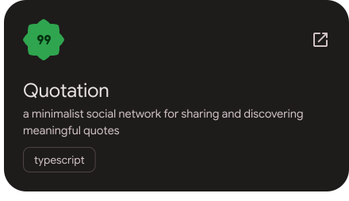
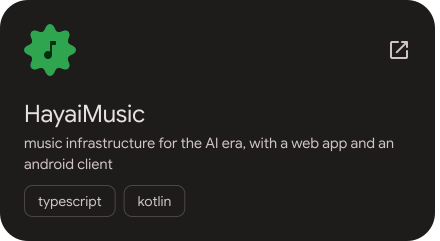
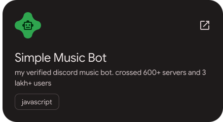

<!-- Hero, project cards and footer are styled after sc.is-a.dev (Material 3 Expressive). Images live in assets/m3. -->

<a href="https://sc.is-a.dev"><picture><source media="(prefers-color-scheme: dark)" srcset="assets/m3/hero-dark.svg"><source media="(prefers-color-scheme: light)" srcset="assets/m3/hero-light.svg"></picture></a>

  
  
  
  

  
  
  

## 🚀 Projects

<a href="https://github.com/SC136/beam-share"><picture><source media="(prefers-color-scheme: dark)" srcset="assets/m3/proj-1-dark.svg"><source media="(prefers-color-scheme: light)" srcset="assets/m3/proj-1-light.svg"></picture></a><a href="https://www.quotation.social"><picture><source media="(prefers-color-scheme: dark)" srcset="assets/m3/proj-2-dark.svg"><source media="(prefers-color-scheme: light)" srcset="assets/m3/proj-2-light.svg"></picture></a> 
<a href="https://music.hayai.tech"><picture><source media="(prefers-color-scheme: dark)" srcset="assets/m3/proj-3-dark.svg"><source media="(prefers-color-scheme: light)" srcset="assets/m3/proj-3-light.svg"></picture></a><a href="https://github.com/SC136/Simple-Music-Bot"><picture><source media="(prefers-color-scheme: dark)" srcset="assets/m3/proj-4-dark.svg"><source media="(prefers-color-scheme: light)" srcset="assets/m3/proj-4-light.svg"></picture></a>

## 🧰 Tech stack

  

  
  
  
  
  

## 🎧 Lately

  
  

## 📊 GitHub stats

  

## 💬 Come hang out

Anime, programming, memes, gaming.

  

<a href="https://sc.is-a.dev"><picture><source media="(prefers-color-scheme: dark)" srcset="assets/m3/footer-dark.svg"><source media="(prefers-color-scheme: light)" srcset="assets/m3/footer-light.svg"></picture></a>

